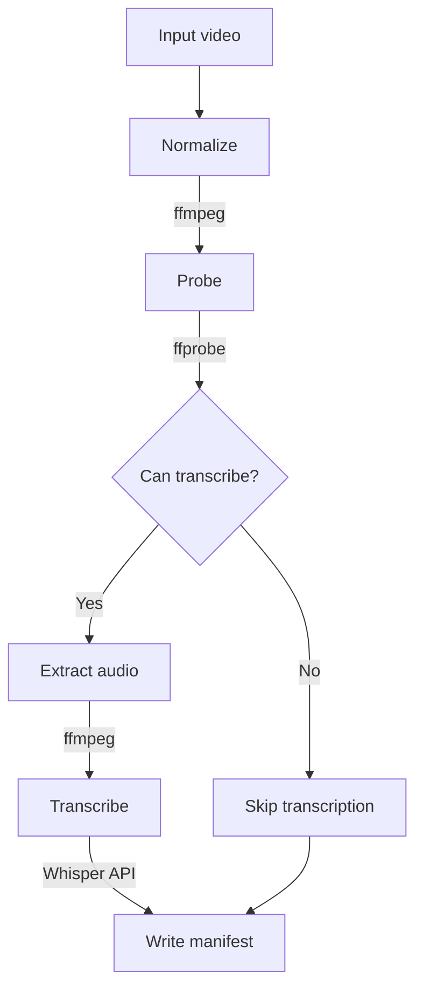

# influenca

Say it like `influenza` but with a a `c`

```shell
npm install influenca
influenca ~/my-media --exif
```

## Content intake

move `avi` files from your Windows `G:` drive to a time-stamped temporary folder

```bash
./scripts/intake.sh g
```

## Development

- Install dependencies:

```bash
pnpm install
```

- Run the unit tests:

```bash
pnpm run test
```

- Build the library:

```bash
pnpm run build
```

## Speech-to-Text Transcription

Transcription is implemented in the current pipeline, but it only runs when the input has an audio stream and `OPENAI_API_KEY` is set. The workflow uses `fluent-ffmpeg` for media handling and OpenAI's Whisper API for transcription.

### Workflow



### Tools In Use

- `ffmpeg` via `fluent-ffmpeg` for transcoding and audio extraction
- `ffprobe` via `fluent-ffmpeg` for duration, frame count, and stream detection
- OpenAI Whisper API for transcription
- `fs` and `path` for local file and manifest handling

The manifest is written to `tmp/processed_videos/<timestamp>/.influenca.json` after each run.
