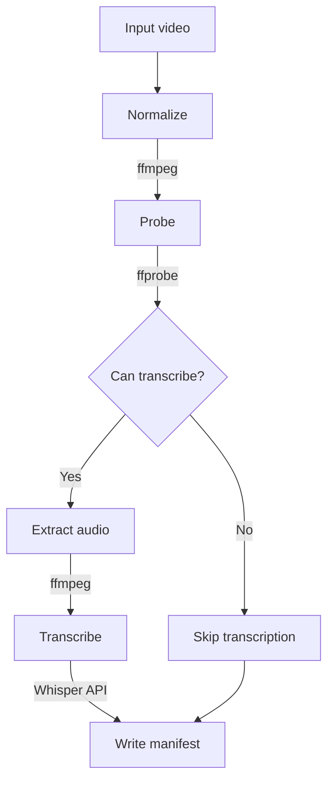

# influenca

Say it like `influenza` but with a a `c`

```shell
npm install influenca
influenca ~/my-media --exif
```

## Content intake

move `avi` files from your Windows `G:` drive to a time-stamped temporary folder

```bash
./scripts/intake.sh g
```

## Development

- Install dependencies:

```bash
pnpm install
```

### Source-first monorepo baseline

The workspace is source-first for local development.

- Typecheck and tests run from source across workspace packages.
- Libraries (`core`, `shared`) are internal TypeScript packages first; `dist` output is optional and disposable.
- Apps (`cli`, `web`) are build targets; app builds are the primary required artifacts.
- Build speed optimizations (`dist`-first workflows, `.tsbuildinfo` tuning, declaration bundling requirements) are optional and should only be introduced after measuring a real bottleneck.

In practice: use `pnpm run lint`, `pnpm run typecheck`, and `pnpm run test` as the default feedback loop. Run `pnpm run build` when you need runnable artifacts.

- Run the full workspace checks:

```bash
pnpm run check
```

- Build apps and libraries to dist:

```bash
pnpm run build
```

- Run CLI end-to-end smoke test:

```bash
pnpm run build && ./scripts/e2e-all.sh
```

- Typecheck all projects:

```bash
pnpm run typecheck
```

- Lint all projects:

```bash
pnpm run lint
```

- Test all projects:

```bash
pnpm run test
```

## Speech-to-Text Transcription

Transcription is implemented in the current pipeline, but it only runs when the input has an audio stream and `OPENAI_API_KEY` is set. The workflow uses `fluent-ffmpeg` for media handling and OpenAI's Whisper API for transcription.

### Workflow


```mermaid
flowchart TD
    A["Input video"]
    B["Normalize"]
    C["Probe"]
    D{"Can transcribe?"}
    E["Extract audio"]
    F["Transcribe"]
    G["Skip transcription"]
    H["Write manifest"]

    A --> B
    B -->|"ffmpeg"| C
    C -->|"ffprobe"| D
    D -->|Yes| E
    D -->|No| G
    E -->|"ffmpeg"| F
    F -->|"Whisper API"| H
    G --> H
```

### Tools In Use

- `ffmpeg` via `fluent-ffmpeg` for transcoding and audio extraction
- `ffprobe` via `fluent-ffmpeg` for duration, frame count, and stream detection
- OpenAI Whisper API for transcription
- `fs` and `path` for local file and manifest handling

The manifest is written to `tmp/processed_videos/<timestamp>/.influenca.json` after each run.
