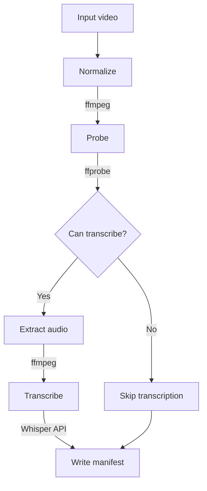

# influenca

Say it like `influenza` but with a a `c`

```shell
npm install influenca
influenca ~/my-media --exif
```

## Content intake

### USB media and Android phones

Use the cross-platform intake script from Linux, WSL, or macOS. It detects
auto-mounted USB/SD volumes first, then Android via Linux `adb`, Windows
`adb.exe` in WSL, `simple-mtpfs`, or GNOME GVfs (`gio`):

```sh
# Automatically detect the connected source (last 2 days of mp4/mov)
./scripts/intake.sh

# Choose a transport or adjust the source and filters
./scripts/intake.sh --transport adb --max-days 3 --extensions mp4,mov,avi
./scripts/intake.sh --transport mtp --source-dir "Internal storage/DCIM/Camera"
```

For Android over Linux `adb` in WSL, attach the phone to WSL with
[`usbipd-win`](https://github.com/dorssel/usbipd-win) and enable USB debugging.
The `adb-win` transport uses `adb.exe` from Windows without USB/IP. MTP through
`simple-mtpfs` in WSL may require systemd; `gio` requires a GNOME/GVfs session.
In WSL, the script checks the selected drive under `/mnt` (default `G:`) rather
than scanning every drive letter. If it is not mounted, it tries to mount that
drive using `sudo` and `drvfs`; set `WSL_USB_DRIVE` to another single drive
letter if needed. This may prompt for your Ubuntu password. If WSL automount is
enabled, the selected drive should already appear under `/mnt/<letter>`.
For a custom directory layout, pass `--source-dir`; use a device path for `adb`
and a mounted path for `mtp`. For `gio`, use a path relative to the device root
or a full `mtp://` URI.

On success, the script prints a ready-to-paste `influenca accession` command.
The previous Windows Shell MTP implementation remains deprecated at
[`scripts/windows/intake-android.ps1`](scripts/windows/intake-android.ps1).

## Development

- Install dependencies:

```bash
pnpm install
```

### Source-first monorepo baseline

The workspace is source-first for local development.

- Typecheck and tests run from source across workspace packages.
- Libraries (`core`, `shared`) are internal TypeScript packages first for local checks, and runtime package exports point to built JavaScript in `dist`.
- Apps (`cli`, `web`) are build targets; app builds are the primary required artifacts.
- Third-party dependencies are consumed from `node_modules` (external), not bundled into app artifacts by default.
- Build speed optimizations (`.tsbuildinfo`, incremental tuning, extra orchestration) are optional and should only be introduced after measuring a real bottleneck.

### Two-mode contract

- Runtime mode (`cli`/CI/prod): apps import library package runtime exports (`dist/*.mjs`).
- Web dev mode (HMR): `apps/web` aliases workspace libs to `src/index.ts` for instant source edits.
- Dependency ownership: each package declares only what it directly imports in source.

In practice: use `pnpm run lint`, `pnpm run typecheck`, and `pnpm run test` as the default feedback loop. Run `pnpm run build` when you need runnable artifacts.

- Run the full workspace checks:

```bash
pnpm run check
```

- Build apps and libraries to dist:

```bash
pnpm run build
```

- Run CLI end-to-end smoke test:

```bash
pnpm run build && ./scripts/e2e-all.sh
```

- Typecheck all projects:

```bash
pnpm run typecheck
```

- Lint all projects:

```bash
pnpm run lint
```

- Test all projects:

```bash
pnpm run test
```

## Speech-to-Text Transcription

Transcription is implemented in the current pipeline, but it only runs when the input has an audio stream and `OPENAI_API_KEY` is set. The workflow uses `fluent-ffmpeg` for media handling and OpenAI's Whisper API for transcription.

### Workflow


```mermaid
flowchart TD
    A["Input video"]
    B["Normalize"]
    C["Probe"]
    D{"Can transcribe?"}
    E["Extract audio"]
    F["Transcribe"]
    G["Skip transcription"]
    H["Write manifest"]

    A --> B
    B -->|"ffmpeg"| C
    C -->|"ffprobe"| D
    D -->|Yes| E
    D -->|No| G
    E -->|"ffmpeg"| F
    F -->|"Whisper API"| H
    G --> H
```

### Tools In Use

- `ffmpeg` via `fluent-ffmpeg` for transcoding and audio extraction
- `ffprobe` via `fluent-ffmpeg` for duration, frame count, and stream detection
- OpenAI Whisper API for transcription
- `fs` and `path` for local file and manifest handling

The manifest is written to `tmp/processed_videos/<timestamp>/.influenca.json` after each run.
