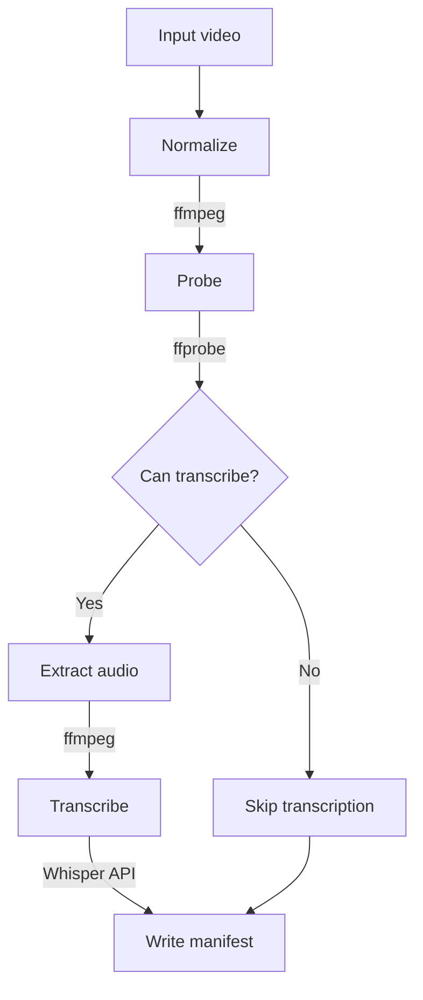

# influenca

Say it like `influenza` but with a a `c`

```shell
npm install influenca
influenca ~/my-media --exif
```

## Content intake

### SD card / USB drive (WSL)

Move `avi` / `wav` files from a Windows drive (e.g. `G:`) to a timestamped folder,
then print the ready-to-run `accession` command:

```sh
./scripts/intake.sh g
```

### Android phone (MTP via Windows Shell)

Phone enumeration and file copying require the Windows Shell COM API (MTP).
Run this from **PowerShell 7 on Windows** (`pwsh.exe`):

```powershell
# Defaults: first MTP device found, last 7 days of media
pwsh.exe -File scripts\intake-android.ps1

# Target a specific phone by partial name, copy last 3 days
pwsh.exe -File scripts\intake-android.ps1 -PhoneName "Pixel" -MaxAgeDays 3

# Copy ALL camera files (no age filter)
pwsh.exe -File scripts\intake-android.ps1 -PhoneName "Galaxy" -MaxAgeDays 0
```

Or invoke it directly from a WSL terminal (requires `pwsh.exe` on the Windows `PATH`):

```bash
pwsh.exe -File "$(wslpath -w ./scripts/intake-android.ps1)"
```

The script automatically resolves your WSL home directory and prints a
**WSL-native, pasteable** next-step command — no Windows paths leak into the output:

```
✨ Next step — paste into your WSL terminal:

  influenca accession "/home/gary/.local/state/influenca/2026-09-28_17-30-00/pixel-9-pro" --transcribe true
```

## Development

- Install dependencies:

```bash
pnpm install
```

### Source-first monorepo baseline

The workspace is source-first for local development.

- Typecheck and tests run from source across workspace packages.
- Libraries (`core`, `shared`) are internal TypeScript packages first for local checks, and runtime package exports point to built JavaScript in `dist`.
- Apps (`cli`, `web`) are build targets; app builds are the primary required artifacts.
- Third-party dependencies are consumed from `node_modules` (external), not bundled into app artifacts by default.
- Build speed optimizations (`.tsbuildinfo`, incremental tuning, extra orchestration) are optional and should only be introduced after measuring a real bottleneck.

### Two-mode contract

- Runtime mode (`cli`/CI/prod): apps import library package runtime exports (`dist/*.mjs`).
- Web dev mode (HMR): `apps/web` aliases workspace libs to `src/index.ts` for instant source edits.
- Dependency ownership: each package declares only what it directly imports in source.

In practice: use `pnpm run lint`, `pnpm run typecheck`, and `pnpm run test` as the default feedback loop. Run `pnpm run build` when you need runnable artifacts.

- Run the full workspace checks:

```bash
pnpm run check
```

- Build apps and libraries to dist:

```bash
pnpm run build
```

- Run CLI end-to-end smoke test:

```bash
pnpm run build && ./scripts/e2e-all.sh
```

- Typecheck all projects:

```bash
pnpm run typecheck
```

- Lint all projects:

```bash
pnpm run lint
```

- Test all projects:

```bash
pnpm run test
```

## Speech-to-Text Transcription

Transcription is implemented in the current pipeline, but it only runs when the input has an audio stream and `OPENAI_API_KEY` is set. The workflow uses `fluent-ffmpeg` for media handling and OpenAI's Whisper API for transcription.

### Workflow


```mermaid
flowchart TD
    A["Input video"]
    B["Normalize"]
    C["Probe"]
    D{"Can transcribe?"}
    E["Extract audio"]
    F["Transcribe"]
    G["Skip transcription"]
    H["Write manifest"]

    A --> B
    B -->|"ffmpeg"| C
    C -->|"ffprobe"| D
    D -->|Yes| E
    D -->|No| G
    E -->|"ffmpeg"| F
    F -->|"Whisper API"| H
    G --> H
```

### Tools In Use

- `ffmpeg` via `fluent-ffmpeg` for transcoding and audio extraction
- `ffprobe` via `fluent-ffmpeg` for duration, frame count, and stream detection
- OpenAI Whisper API for transcription
- `fs` and `path` for local file and manifest handling

The manifest is written to `tmp/processed_videos/<timestamp>/.influenca.json` after each run.
